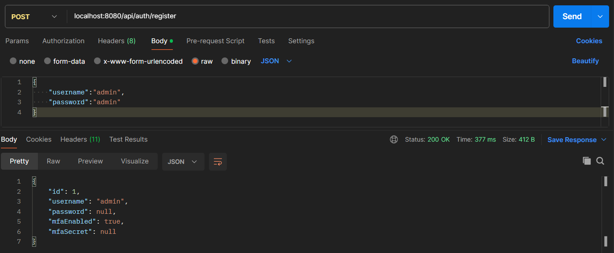
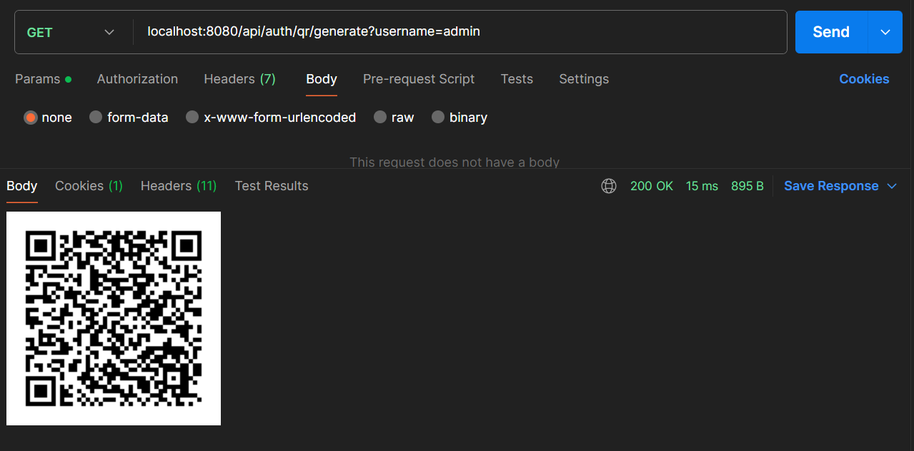
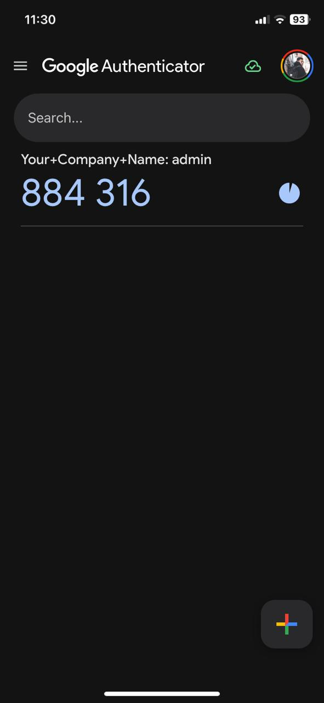

# Two-Factor Authentication (TOTP) with Google Authenticator

This Spring Boot-based project implements Two-Factor Authentication (TOTP) using Google Authenticator. It includes user registration, TOTP QR code generation, login, and TOTP verification.

## Features

1. **User Registration with MFA enabled**:
    - Allows users to register with Multi-Factor Authentication (MFA) enabled by default.



2. **Generate TOTP QR Image**:
    - Generates a base64-encoded QR code image that can be scanned using the Google Authenticator app.



3. **User Login**:
    - Authenticates the user with their username and password, and checks if MFA is required.


4. **Verify TOTP Code**:
    - Validates the TOTP code generated by the Google Authenticator app and, if successful, returns a JWT token for the user.




## Prerequisites

- Java 17
- Spring Boot
- H2 Database
- Google Authenticator App

## Setup and Running the Project

1. Clone the repository.

   ```bash
   git clone https://github.com/gitshishirkarki/totp-googleauth-springboot.git
   ```

2. Navigate to the project directory.

   ```bash
   cd totp-googleauth-springboot
   ```

3. Build and run the project using Maven.

   ```bash
   mvn spring-boot:run
   ```

4. Access the API endpoints via `http://localhost:8080`.

5. Access H2 database via `http://localhost:8080/h2-console`.

## Usage Workflow

1. **Register a new user**
2. **Generate TOTP QR code**
3. **Scan TOTP QR code in Google Authenticator**
4. **Login the user**
5. **Verify TOTP code**

## License

This project is licensed under the MIT License - see the [LICENSE](LICENSE) file for details.